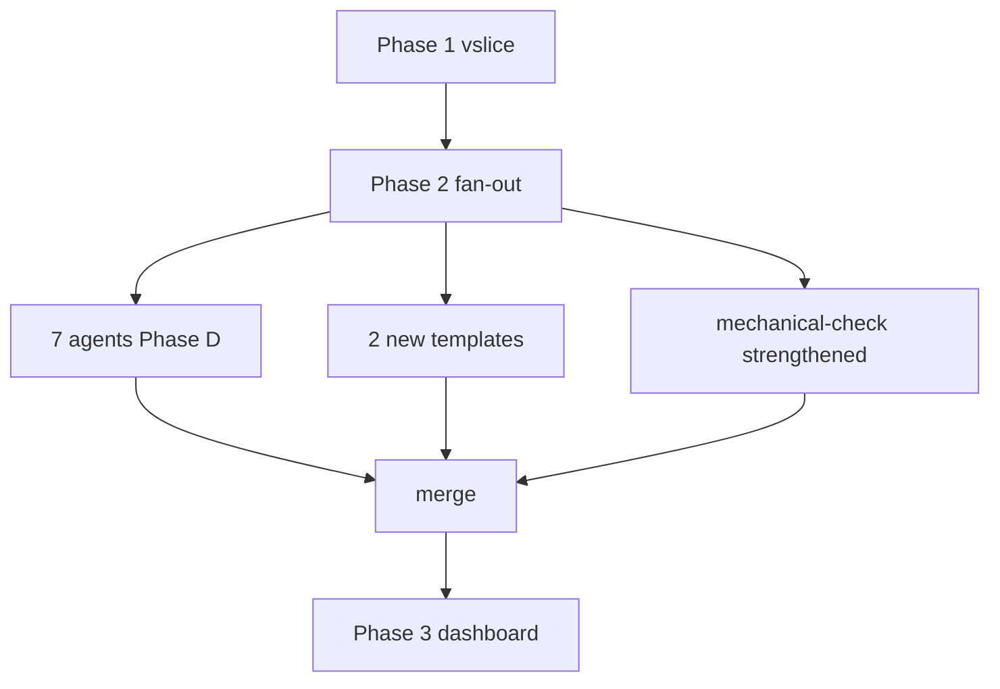

# PROGRESS.md — 팀신짱 Phase 2 fan-out 골든 샘플

## Overview

본 PROGRESS는 Phase 2 fan-out 단계의 골든 샘플이다. 7개 에이전트 Phase D 분기 + 2개 잔여 템플릿(PROGRESS/RETROSPECTIVE) 신설 + mechanical-check HA/HB/HC 강화 + 골든 fixture 신설을 한 wave로 묶어 실행한다. Phase 1 vslice의 NFR-3 통과(token ratio 1.5506)를 골든 기준으로 삼아 본 PROGRESS HTML도 동일 휴리스틱으로 측정한다.

### Architecture Diagram

---

### Wave Execution Summary

| Wave | Phases | Parallel | Artifact Dependency |
|------|--------|----------|---------------------|
| Wave 2 | Phase 2, Phase 3 | true | Phase 1 통과 후, 서로 파일 충돌 없음 |

---

## Phase 2: 7 에이전트 + 잔여 템플릿 fan-out (AC-2b)

**Agent**: kazama (구현) + bunta (회귀 테스트)
**Wave**: 2 | **Parallel**: true
**Depends on**: Phase 1
**artifact_dependency**: Phase 1의 REQUESTS.html.tpl + docs/HTML_STYLE_GUIDE.md + Phase 1 vslice의 NFR-3 통과 결과(token ratio ≤2×)

### Rationale

Phase 1에서 misae+REQUESTS.html 파이프라인을 증명했다. 이제 동일 패턴을 7개 에이전트(nene, masumi, bo, bunta, himawari, kazama, aichan)와 2개 잔여 doc 타입(PROGRESS, RETROSPECTIVE)으로 확장한다. 출력 doc과 에이전트 간 매핑이 1:1이 아니므로 세분화가 필요하다. PROGRESS write 권한자 3명(nene/shinnosuke/himawari)의 doc-write 로직을 분기형으로 바꾸고, RETROSPECTIVE write 권한자 1명(masumi)의 doc-write 로직도 분기형으로 바꾼다. PROGRESS contributor 4명(bo/bunta/kazama/aichan)은 보고 포맷만 표준화한다.

Alternative rejected: 에이전트당 별도 sub-phase로 쪼개기 — Phase 2-1, 2-2, …, 2-7 → 오버헤드 큼. 대신 한 Phase에 Step 단위로 6개 묶음으로 분할.

### 목표

- 2개 잔여 HTML 템플릿 신설 (PROGRESS.html.tpl, RETROSPECTIVE.html.tpl)
- 7 에이전트 Phase D 분기형 수정 완료 → AC-2 전체 통과
- 모든 doc-owner의 mechanical-check 호출이 HTML 모드 자동 분기
- 스타일 가이드를 PROGRESS/RETROSPECTIVE 클래스셋까지 확장 완료

### 변경 사항

| Action | File | Reason |
|--------|------|--------|
| Create | `agents/_shared/templates/PROGRESS.html.tpl` | FR-1/AC-1: PROGRESS.md.tpl와 의미상 동등 HTML |
| Create | `agents/_shared/templates/RETROSPECTIVE.html.tpl` | FR-1/AC-1: RETROSPECTIVE.md.tpl와 의미상 동등 HTML |
| Modify | `docs/HTML_STYLE_GUIDE.md` | FR-10/AC-12: phase/retrospective 클래스셋 추가 |
| Modify | `agents/nene.md` | FR-1/AC-2: PROGRESS output_format 분기 |
| Modify | `agents/masumi.md` | FR-1/AC-2: RETROSPECTIVE+IMPLEMENTATION 분기 |
| Modify | `agents/bo.md` | FR-2: 보고 포맷 표준화 |
| Modify | `agents/bunta.md` | FR-2: 보고 포맷 표준화 |
| Modify | `agents/himawari.md` | FR-1/AC-2: PROGRESS write 분기 |
| Modify | `agents/kazama.md` | FR-2: 보고 포맷 표준화 |
| Modify | `agents/aichan.md` | FR-2: 보고 포맷 표준화 |
| Modify | `src/mechanical-check.js` | HB-1/HB-2 보강 (article/section 시맨틱 태그) |
| Modify | `tests/mechanical-check-html.test.js` | PROGRESS/RETROSPECTIVE 2케이스 추가 |

Cross-reference check:
- `agents/shinnosuke.md`는 본 Phase 영역 외 (별도 phase에서 처리)
- Step 2-5의 drift-check는 기존 markdown 회귀를 유지

### 성공 기준

- [ ] AC-2b: 7 에이전트 전부 output_format 토글 진입점 보유
- [ ] AC-1c: PROGRESS/RETROSPECTIVE.html.tpl 각각 data-ts-kind 5개 이상
- [ ] AC-4b: mechanical-check-html 테스트 11케이스 통과
- [ ] AC-12b: HTML_STYLE_GUIDE phase/retrospective/change-log/risk-register H3 ≥ 4
- [ ] NFR-3: PROGRESS/RETROSPECTIVE 골든 token_ratio ≤ 2.0

### Change Log

| Date | Author | Note |
|------|--------|------|
| 2026-05-17 | kazama | Phase 2 fan-out 초안 작성 — 7 에이전트 + 2 템플릿 |

---

## Risk Register

| ID | Phase | Risk | Severity | Mitigation |
|----|-------|------|----------|------------|
| R-1 | Phase 2 | 7 에이전트 동시 회귀 → 워크플로 정지 | H | Phase 1 vslice 통과 후 fan-out, 단위 테스트로 격리, output_format 토글 회귀 안전 |
| R-2 | Phase 2 | 새 템플릿 토큰 ≤2× 초과 가능 | M | html-token-estimator로 매 템플릿 측정, 위반 시 시맨틱 절제 |
| R-3 | Phase 2 | mechanical-check HB 강화로 기존 케이스 회귀 | M | 7 baseline cases 회귀 테스트 통과 확인 (baseline 보존) |

---

## Effort Estimates

| Phase | FR | Files Changed | Effort | Agent |
|-------|----|---------------|--------|-------|
| Phase 2 | FR-1, FR-2, FR-3, FR-10 | 13 (2 tpl + guide + 7 agents + mech + test + decision) | XL | kazama + bunta |

---

## Validation Checklist

- [x] All FR items assigned to phases
- [x] All NFR items addressed (NFR-3 token gate)
- [x] All HR items addressed
- [x] All risks have mitigations
- [x] All AC items covered by phase success criteria
- [x] File conflict analysis complete (Phase 3 disjoint from Phase 2)
- [x] Wave grouping validated — no file conflicts within same wave
- [x] artifact_dependency set where required (Phase 1 NFR-3 통과)
- [ ] User approval pending (Phase 2 골든, no real user)
